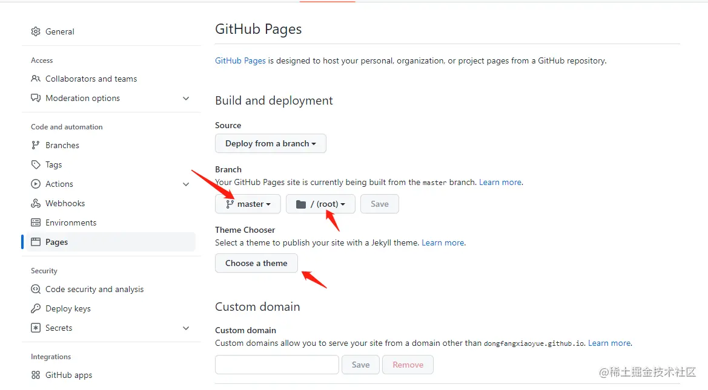
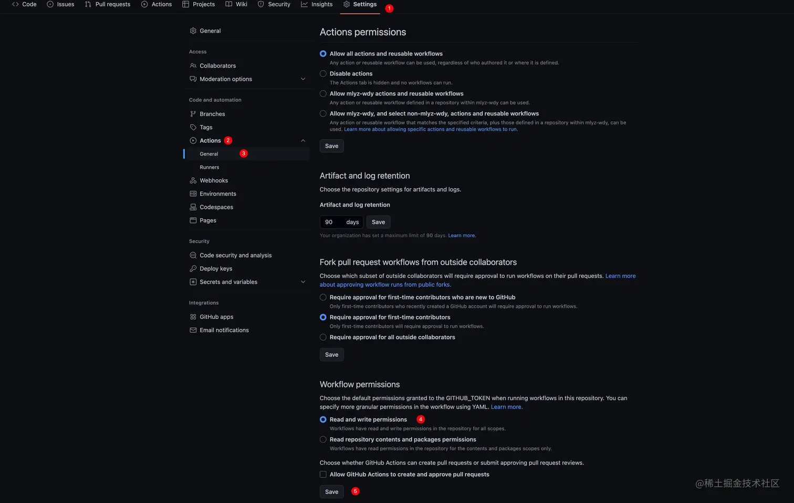

## 打造组件库的说明网站

新建一个文件夹 website 在根目录下 并 初始化

```ts
mkdir website  && cd  website
pnpm init
// 安装依赖
pnpm add -D vitepress vue
// 添加docs 文件 并写入对应的文件
mkdir docs && echo '# Hello VitePress' > docs/index.md

```

然后我们在 package.json 中添加对应的命令

```json
"scripts": {
    "docs:dev": "vitepress dev docs",
    "docs:build": "vitepress build docs",
    "docs:preview": "vitepress preview docs"
  },

```

通过 pnpm run docs:dev 启动项目就可以预览我们的项目了  
启动项目后会发现多出对应的.vitepress 文件夹  
在文件夹先新建文件 config.ts 用于配置相关网站结构

```
.
├─ docs
│  ├─ .vitepress
│  │  ├─ config.js // 打包配置的文件
│  ├─ guild // 指南的的文件夹
│  │  ├─  // 对应文件
│  │  └─ ...
│  ├─ component // 组件相关
│  │  ├─ button // 按钮
└─ package.json

```

配置 config.js 的内容 相关配置可以参考 vitepress 官网

```js
export default {
	title: "wingplus",
	description: "这是一个UI库",
	base: "/wingplus-ui/", //这里一定要对应仓库的名称
	themeConfig: {
		siteTitle: "wingplusUI",
		nav: [
			{ text: "首页", link: "/" },
			{ text: "指南", link: "/guild/" },
			{ text: "组件", link: "/components/button/" }
		],

		socialLinks: [{ icon: "github", link: "https://github.com/wing-king/wingplus-ui" }],
		sidebar: {
			"/guild/": [
				{
					text: "基础",
					items: [
						{
							text: "安装",
							link: "/guild/installation/"
						},
						{
							text: "快速开始",
							link: "/guild/quickstart/"
						}
					]
				},
				{
					text: "进阶",
					items: [
						{
							text: "xx",
							link: "/xx"
						}
					]
				}
			],
			"/components/": [
				{
					text: "基础组件",
					items: [
						{
							text: "Button",
							title: "按钮组件",
							link: "/components/button/"
						},
						{
							text: "Icon",
							link: "/components/icon/"
						}
					]
				}
			]
		}
	},
	locales: {
		"/": {
			lang: "zh-CN"
		}
	}
};
```

<font color="red">babse 这里一定要对应仓库的名称</font>

### 上传到 github 仓库自动执行部署

更目录下建.github/workflows/deploy.yml 对应的文件

```
name: wingplusUI

on:
  push:
    branches:
      - main

jobs:
  deploy:
    runs-on: ubuntu-latest
    steps:
      - uses: actions/checkout@v3
        with:
          fetch-depth: 0
      - uses: pnpm/action-setup@v2
        with:
          version: 6.32.9
      - uses: actions/setup-node@v3
        with:
          node-version: 16
          cache: pnpm
      - run: cd website && pnpm install --frozen-lockfile

      - name: Build
        run: cd website && pnpm docs:build && cd ../

      - name: Deploy
        uses: peaceiris/actions-gh-pages@v3
        with:
          github_token: ${{ secrets.GITHUB_TOKEN }}
          publish_dir: website/docs/.vitepress/dist

```

以上内容可以直接复制使用，如果想修改，可以看文档自行修改

1. 再上传代码之前一定要在项目下新建一个分支 <font color="red">gh-pages</font>上面的配置文件中会用到
2. 上传对应的代码带仓库中
3. 在 github 当前仓库页点击 settings/pages 中更换源为 gh-pages 参考下面的图片 

**注意点**
出现 The process ‘/usr/bin/git‘ failed with exit code 128
请参考这个设置


最后让我们输入我们的网址

[点看这个地址就可以预览啦](https://wing-king.github.io/wingplus-ui/)
